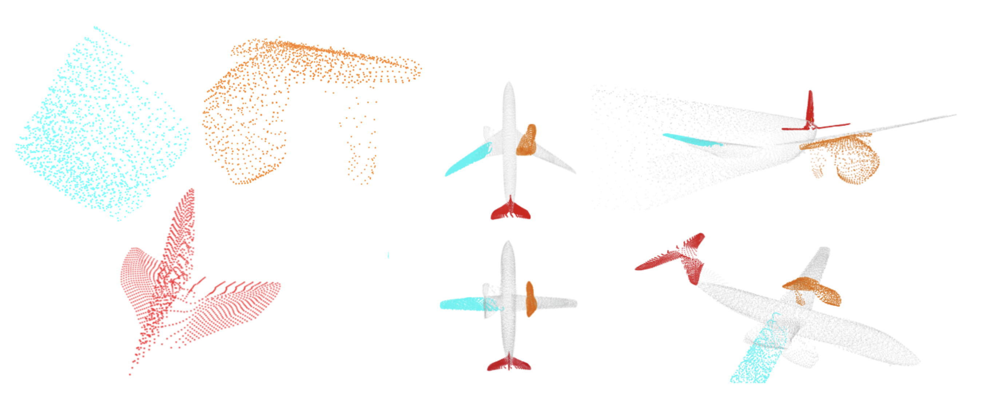

    

# AtlasNet V2 - Learning Elementary Structures
This work was build upon [Thibault Groueix](https://github.com/ThibaultGROUEIX/)'s [AtlasNet](https://github.com/ThibaultGROUEIX/AtlasNet) and [3D-CODED](https://github.com/ThibaultGROUEIX/3D-CODED) projects. (you might want to have a look at those)

This repository contains the source codes for the paper [AtlasNet V2 - Learning Elementary Structures](https://arxiv.org/abs/1908.04725).

### Citing this work

If you find this work useful in your research, please consider citing:

```
@article{deprelle2019learning,
  title={Learning elementary structures for 3D shape generation and matching},
  author={Deprelle, Theo and Groueix, Thibault and Fisher, Matthew and Kim, Vladimir G and Russell, Bryan C and Aubry, Mathieu},
  journal={arXiv preprint arXiv:1908.04725},
  year={2019}
}
```

### Project Page

The project page is available http://imagine.enpc.fr/~deprellt/atlasnet2/

# Install

### Clone the repo and install dependencies 

This implementation uses [Pytorch](http://pytorch.org/).

```shell
## Download the repository
git clone https://github.com/TheoDEPRELLE/AtlasNetV2.git
cd AtlasNetV2
## Create python env with relevant packages
conda create --name atlasnetV2 python=3.7
source activate atlasnetV2
pip install pandas visdom
conda install pytorch torchvision -c pytorch
conda install -c conda-forge matplotlib
# you're done ! Congrats :)

```

# Training

### Data

```shell
cd data; ./download_data.sh; cd ..
```
We used the [ShapeNet](https://www.shapenet.org/) dataset for 3D models.

When using the provided data make sure to respect the shapenet [license](https://shapenet.org/terms).

* [The point clouds from ShapeNet, with normals](https://cloud.enpc.fr/s/j2ECcKleA1IKNzk) go in ``` data/customShapeNet```
* [The corresponding normalized mesh (for the metro distance)](https://cloud.enpc.fr/s/RATKsfLQUSu0JWW) go in ``` data/ShapeNetCorev2Normalized```
* [the rendered views](https://cloud.enpc.fr/s/S6TCx1QJzviNHq0) go in ``` data/ShapeNetRendering```

The trained models and some corresponding results are also available online :

* [The trained_models](https://cloud.enpc.fr/s/c27Df7fRNXW2uG3) go in ``` trained_models/```


### Build chamfer distance

The chamfer loss is based on a custom cuda code that need to be compile.

```shell
source activate pytorch-atlasnet
cd ./extension
python setup.py install
```


### Start training

* First launch a visdom server :

```bash
python -m visdom.server -p 8888
```

* Check out all the options :

```shell
git pull; python training/train.py --help
```

* Run the baseline :

```shell
git pull; python training/train.py --model AtlasNet --adjust mlp
git pull; python training/train.py --model AtlasNet --adjust linear
```
* Run the Patch Deformation module with the different adjustment modules :

```shell
git pull; python training/train.py --model PatchDeformation --adjust mlp
git pull; python training/train.py --model PatchDeformation --adjust linear
```

* Run the Point Translation module with the different adjustment modules:

```shell
git pull; python training/train.py --model PointTranslation --adjust mlp
git pull; python training/train.py --model PointTranslation --adjust linear
```


* Monitor your training on http://localhost:8888/

## Trained models

Coming soon...

## Acknowledgement

This work was partly supported by ANR project EnHerit ANR-17-CE23-0008, Labex Bezout, and gifts from Adobe to Ecole des Ponts.


## License

[MIT](https://github.com/ThibaultGROUEIX/AtlasNet/blob/master/license_MIT)
.